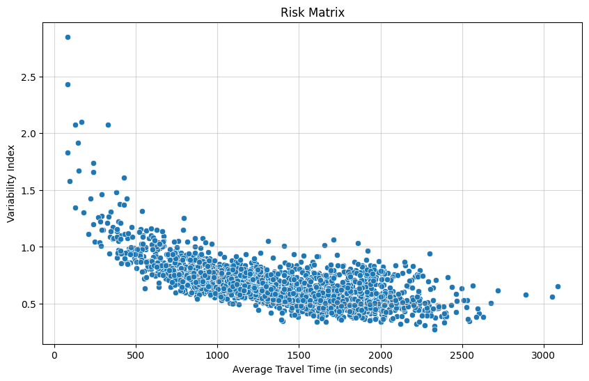
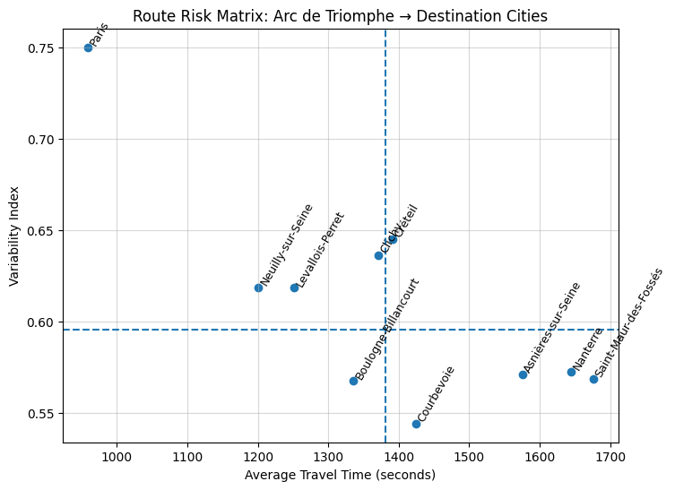

# Uncovering Estimated Time of Arrival: Travel Time Variability and Reliability in Urban Mobility

## Summary
This project analyzes travel time variability across urban routes to move beyond average-based ETA estimation and surface hidden reliability risk in city mobility.

While most routing and ETA systems optimize for mean travel time, this analysis demonstrates it may not be enough and averages alone mask user-facing uncertainity, especially on short high-traffic routes. By explicitly modeling variability, I identify routes that appear efficient in aggregate metrics but generate poor ETA confidence.

The outcome is *route-level reliability framework* that can inform ETA design, user messaging and surge of buffering logic.

## Data
The data is from the Uber Movement in Paris (2016). You can browse it [here](<data/Travel_Times - Paris.csv>).

All routes start from the same origin - Arc de Triomphe.


## Core Question
Which routes are the most unreliable and do the route "speed" and ETA confidence correlate?

## Methodology
### 1. Variability Index

To quantify reliability risk, I compute a Variability Index for each route:

```
Variability Index = (Upper Time Bound - Lower Time Bound) / Average Time
```
This metric captures relative dispersion. Two routes can have same average duration but different experiences depending on the width of their time distribution.

### Risk Flag
Routes are categorized using 2-step logic:

**1. Risk Identification**
  - VI is treated as the **primary** risk factor
  - Routes exceeding 75th percentile of variability are flagged as **risky**, no matter what their average travel time is

**2. Stable Route Segmentation**
  - Remaining routes (below the risk threshold) are segmented by **median travel time**:
    - Short
    - Long


## Route Reliablity Classification
- Predictable -> low average time, low variability, consistent ETA experience
- Long -> high average time, low variability, slow but reliable
- Gamble -> High variability, any average time, unstable ETA and high user risk

## Key Insight
The shortest routes are the most unpredictable.

Longer routes, while being slower, tend to be more predictable.



This reveals a structural flaw in optimizing solely for average travel time. Short routes look efficient in dashboards but generate highest variance and ETA errors

## Risk Concentration
The riskies routes share a clear pattern:
- Low average travel time
- High variability
- High ETA uncertainty

These routes represent hidden risk.

### Why this matters
Variability is most damaging when:
- route is short -> lower tolerance for error
- the route is frequently used
- users expect precision

## Product Implications (ETA & UX):
- Short routes require larger ETA confidence buffer
- ETAs should be displayed as ranges
- User-facing warnings can be adjusted for risky short routes

## Popular Routes Analysis
Example: Arc de Triomphe -> Destination City

Popularity here is a frequency of appearance in the database.



Each destination city is plotted with:
- X-axis: cost in time
- Y-axis: reliability risk (variability)
Dashed lines sepatate:
- Fast vs. Slow
- Reliable vs. Volatile

#### Insights

- Paris -> fast & risky
- Nanterre/Saint-Maur -> slow but predictable
- Courbevoie / Boulogne -> balanced between speed and reliability

## Paris Deep Dive
Focusing on the top 5 most frequent Paris routes, which fall into the *shortest-time / highest-risk quadrant*.

Insights
- Short, central Paris routes are the most volatile, despite being fast
- Variability is more damaging when routes are high-volume
- Boulevard Périphérique stands out as both slow and unstable

Product Implications
Routes like Boulevard Périphérique requires:
 - Different surge logic
 - Stronger ETA buffers
 - Explicit reliability handling distinct from standard routes

## Key Takeaways
- Average travel time hides user risk
- Variability explains why "fast" routes often feel unreliable
- ETA systems should optimize for trust and confidence, not only speed
- Short, popular urban routes require more ETA buffering, compared to long ones


## Why I did this
Reliability is not evenly distributed across the network.

*It is concentrated, predictable and measurable.*

By modelling it, urban mobility products can:
- reduce cancellations
- increase user trust
- align system optimization with *real* user experience